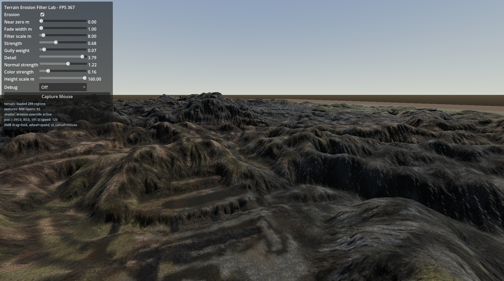
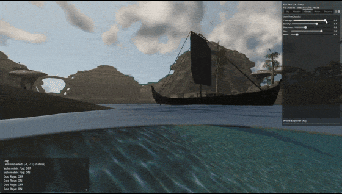

# Godotwind — Lab Notebook

Most of these started as "I wonder how X works" and ended with implementing X to find out. Expect rough edges.

## Contents

- [Analytical shore waves](#analytical-shore-waves)
- [Terrain erosion shader](#terrain-erosion-shader)
- [FFT ocean](#fft-ocean)
- [Flowing rivers](#flowing-rivers)
- [Wetness maps](#wetness-maps)
- [Underwater](#underwater)
- [Cheap volumetric clouds](#cheap-volumetric-clouds)
- [Morrowind night sky](#morrowind-night-sky)
- [Octahedral impostors](#octahedral-impostors)

---

### Analytical shore waves

Those sweet wavelets lapping the beach. The wave model is driven by a distance-to-shore map, so the wavelets actually break where the water meets the sand.

📄 Deep dive: [shore_overhaul.md](docs/plans/shore_overhaul.md)

---

### Terrain erosion shader

Implementation of this shader : https://www.shadertoy.com/view/wXcfWn 
Morrowind terrain is very smooth and very low-poly, so it needs to be used with moderation.

---

### FFT ocean

Implementation of this great project : https://github.com/2Retr0/GodotOceanWaves/ 

Our version has a few differences. Subsurface scattering, spray particles, clipmap LODs (and projected technique, which doesn't work great at the moment), refraction and reflection, above/underwater split camera, and buoyancy on top.

📄 Deep dive: [ocean.md](docs/systems/ocean.md)

---

### Flowing rivers

Morrowind has just one plane of water for everything. Rivers, lakes, ocean = the same infinite plane.
To fix this, we need a way to automatically categorize where rivers should be, where lakes are etc. Of course, this could be done by hand, but it's more fun to see how to do it algorithmically :) 

---

### Wetness maps

<!-- Short note: surfaces darken/gloss when the tide or rain touches them -->

📄 Deep dive: [wetness_system.md](docs/plans/wetness_system.md)

---

### Underwater

Trying to get the underwater effects to appear exactly where the meniscus is.
We have caustics, drifting particles, underwater fog, etc.

Heavily inspired by this great mod for OpenMW : https://www.nexusmods.com/morrowind/mods/53667

📄 Deep dive: [underwater.md](docs/systems/underwater.md)

---

### Morrowind night sky

<!-- Short note -->

📄 Deep dive: [morrowind_night_sky_2026_07_06.md](docs/plans/morrowind_night_sky_2026_07_06.md)

---

### Octahedral impostors

<!-- Short note: single MultiMesh draw call per page for very distant landmarks -->

📄 Deep dive: [impostor_streaming_rendering.md](docs/systems/impostor_streaming_rendering.md)
