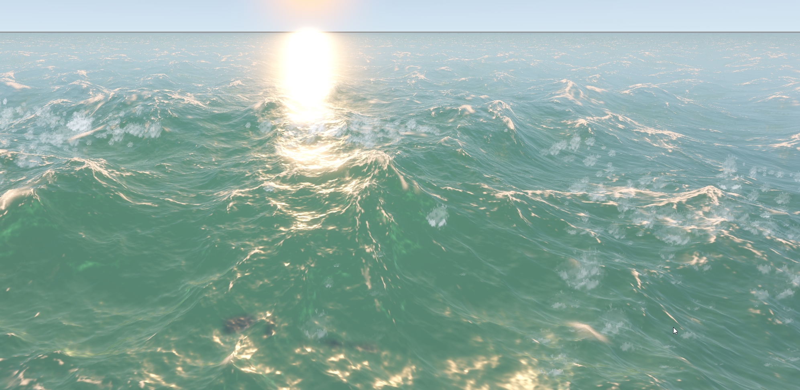
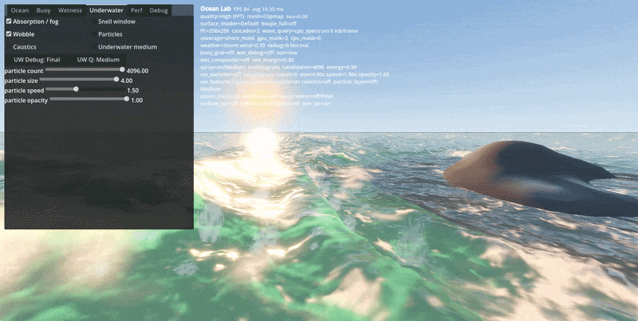
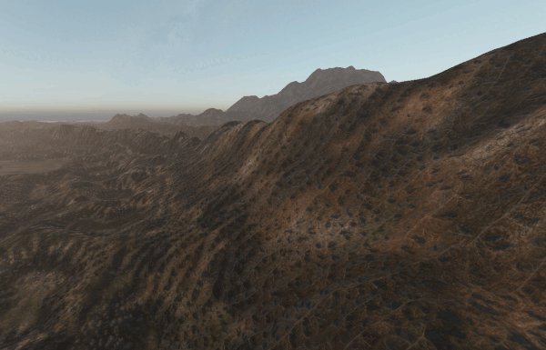
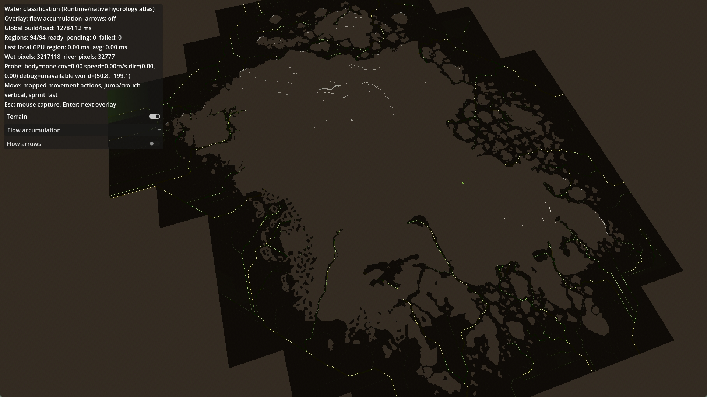
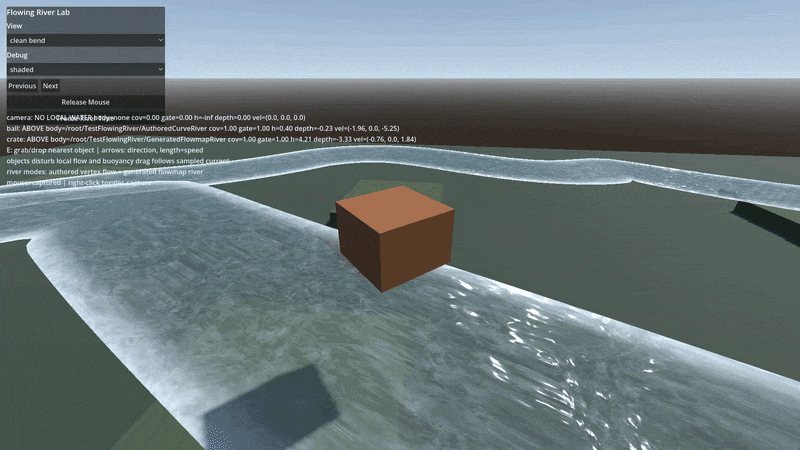
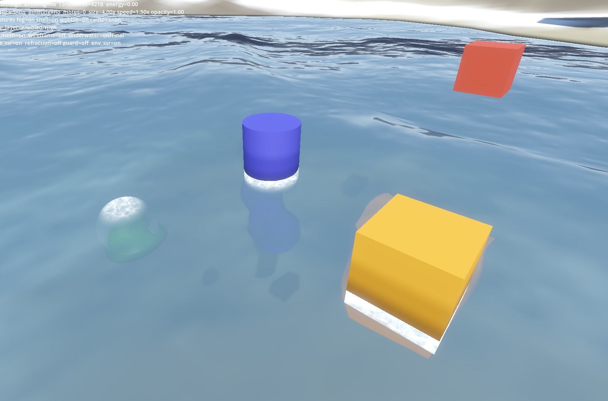
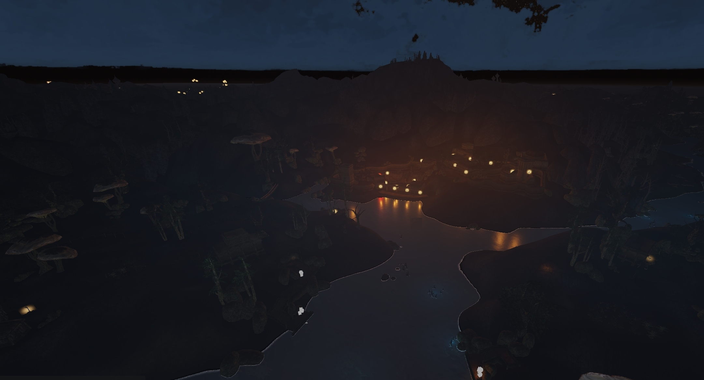
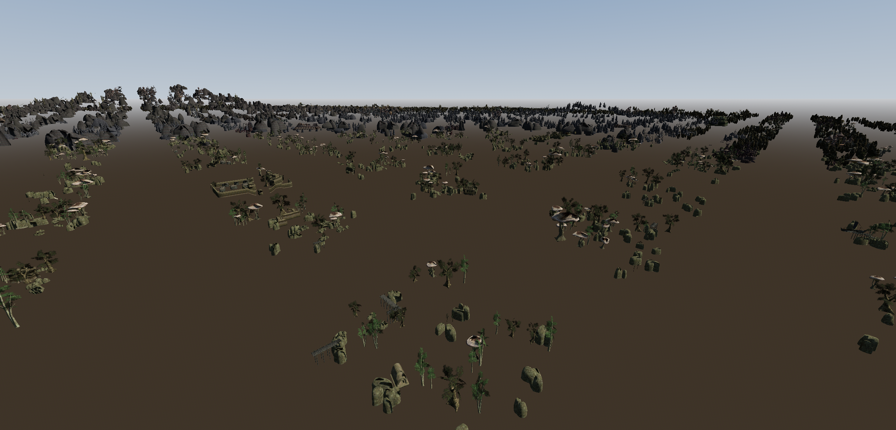
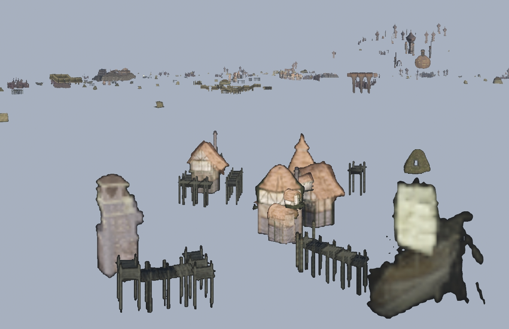

# Godotwind — Lab Notebook

Most of these started as "I wonder how X works" and ended with implementing X to find out. Expect rough edges !
Also, it's not exhaustive by any means. Just the stuff I'm thinking about right now.

## Contents

- [Analytical shore waves](#analytical-shore-waves)
- [Terrain erosion shader](#terrain-erosion-shader)
- [FFT ocean](#fft-ocean)
- [Flowing rivers](#flowing-rivers)
- [Wetness maps](#wetness-maps)
- [Underwater](#underwater)
- [Cheap volumetric clouds](#cheap-volumetric-clouds)
- [Morrowind night sky](#morrowind-night-sky)
- [Octahedral impostors](#octahedral-impostors)

---

### FFT ocean

Implementation of this great project : https://github.com/2Retr0/GodotOceanWaves/ 

Our version has a few differences. Subsurface scattering, spray particles, clipmap LODs (and projected technique, which doesn't work great at the moment), refraction and reflection, above/underwater split camera, and buoyancy on top.

📄 Deep dive: [ocean.md](docs/systems/ocean.md)

---

### Analytical shore waves

To get a nice transition from the FFT Ocean and the shore, we transform the plane into gerstner waves. The wave model is driven by a distance-to-shore map, so the wavelets actually break where the water meets the sand.

📄 Deep dive: [shore_overhaul.md](docs/plans/shore_overhaul.md)

---

### Terrain erosion shader

Implementation of this shader : https://www.shadertoy.com/view/wXcfWn 
Morrowind terrain is very smooth and very low-poly, so it needs to be used with moderation.

---

### Finding rivers

Morrowind has just one plane of water for everything. Rivers, lakes, ocean = the same infinite plane.
To fix this, we need a way to automatically categorize where rivers should be, where lakes are etc. Of course, this could be done by hand, but it's more fun to see how to do it algorithmically :) 

---

### Flowing water

Procedural planes with flow maps and buoyancy. Some objects stay, other float, their presence deforms the texture too. 

---

### Wetness maps

Where objects touch the water, objects get darker and shinier. Also works on the terrain.

📄 Deep dive: [wetness_system.md](docs/plans/wetness_system.md)

---

### Underwater

Trying to get the underwater effects to appear exactly where the meniscus is.
We have caustics, drifting particles, underwater fog, etc.

Heavily inspired by this great mod for OpenMW : https://www.nexusmods.com/morrowind/mods/53667

📄 Deep dive: [underwater.md](docs/systems/underwater.md)

---

### Distant lighting

Inspired by this PR for OpenMW  : https://gitlab.com/OpenMW/openmw/-/merge_requests/5212 

Having distant cities being lit isn't impossible in Godot (clustered forward rendering).
Super WIP so needs a lot of work still.

---

### Merged chunks

To display distant geometries, a classic trick is to get the engine to merge chunks of the static models (trees, buildings, the big stuff that will visible from far away). As we get closer, these chunks are then replaced by the respective LODs of the models.

---

### Octahedral impostors

For the very far away objects (1km and beyond), big objects are shown as impostors with their normal maps. These impostors are pre-rendered, and they load/render super fast.

📄 Deep dive: [impostor_streaming_rendering.md](docs/systems/impostor_streaming_rendering.md)
