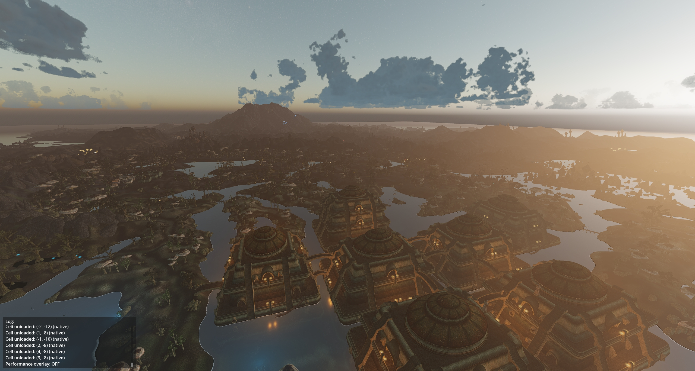
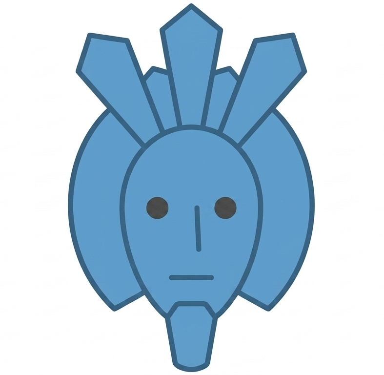

# Godotwind

  

An open-world RPG framework for Godot 4.6, using Morrowind as an example (and even then, it's not a faithful port, more like Morrowind if it was made in 2026). Everything has been vibecoded : Opus, a little bix of Codex, and Fable more recently. I haven't written a line of code.

> 🧪 **Want the fun stuff?** See [EXPERIMENTS.md](EXPERIMENTS.md) — a lab notebook of the little rendering & simulation experiments.

The long-term goal: a general-purpose open-world RPG framework for Godot, where Morrowind is just one "mod" that implements abstract interfaces for terrain, NPCs, dialogue, inventory, and quests.

The current goal : a nice laboratory to do many fun experiments and learn how games are made under the hood. Learning by doing and all that.

**Current state:** World streaming and rendering are okay I guess. Character animations are still WIP, there's a character controller with IK and animation blending.
Some gameplay systems (dialogs, books, grabbing objects Oblivion-style) have barely been started, while others (combat, quests) are not started.

  

## Quick Start

1. **Install Godot 4.6 Mono** (C# support required)
2. **Install Terrain3D addon v1.0.1** — Download from [Terrain3D releases](https://github.com/TokisanGames/Terrain3D/releases/tag/v1.0.1), extract and copy the `addons/terrain_3d/` folder into your project's `addons/` directory. Enable via Project > Project Settings > Plugins.
3. **Configure Morrowind path** — Run `src/tools/settings_tool.tscn`, click Auto-Detect or Browse
4. **Prebake assets** — Run `src/tools/prebaking/prebaking_ui.tscn` to generate terrain, impostors, shore mask and to import Morrowind models / create LODs.
5. **Run** — Open `scenes/Godotwind.tscn`

## Controls

| Key | Action |
|-----|--------|
| Right Mouse | Capture camera |
| WASD/ZQSD | Move |
| Space/Shift | Up/Down |
| Ctrl | Speed boost |
| Scroll | Adjust speed of the flying camera |
| P | Toggle player/fly camera |
| TAB | Interior browser |
| F3 | Performance overlay |
| `` ` `` | Developer console |

## What Works

- **World streaming** — async cell loading, priority queues
- **LODs and all that** — We use pre-merged chunks for distant objects, impostors for very far landmarks, separate the gameplay-relevant objects (like doors) from statics, use different LODs levels, multimeshes where that makes sense, etc.
- **Terrain** — Terrain3D with multi-region support
- **Water** - FFT Ocean with all the bells and whistles (like foam, SSS, particles, clipmap levels, refraction and reflection, etc), shore behavior (for these sweet wavelets lapping the beach), underwater effects, split camera above/underwater, wetness maps. Oh, and buoyancy too.
- **Weather** - clouds from Sunshineclouds2 and Clayjohn's work, Sky, different types of fog, night/day cycle, godrays, weather presets with Rain, Ashstorm, etc.
- **ESM/NIF/BSA parsing** — 47 record types, thread-safe, C# for performance
- **NPC assembly** — body parts from race data, body part mirroring, animations
- **Developer console** — object picking (still suuuuper buggy though), commands

## What Doesn't Work Yet

- Combat, magic, AI, quests, inventory, save/load
- Everything else :)

## Documentation

| Doc | Contents |
|-----|---------|
| [STATUS.md](docs/STATUS.md) | What works, what doesn't (ground truth) |
| [ARCHITECTURE.md](docs/ARCHITECTURE.md) | Systems overview, code map, key patterns |
| [MASTERPLAN.md](docs/audit/MASTERPLAN.md) | Roadmap and architecture decisions |
| [FUTURE_STEPS.md](docs/FUTURE_STEPS.md) | What's next, Godot features we're waiting for |

## Inspirations and references

https://github.com/SlashScreen/skelerealms/
https://github.com/expressobits/character-controller
https://github.com/2Retr0/GodotOceanWaves
https://github.com/Bonkahe/SunshineClouds2

OpenMW, of course https://gitlab.com/OpenMW/openmw
Rafael's Shaders for OpenMW https://www.nexusmods.com/morrowind/mods/53667 

The code is (or should) be cleanly split into the general framework and the Morrowind translation layer. The Morrowind translation layer is still pretty mid but eventually should become its own project, for License purposes. 
It would make sense to borrow a lot of good ideas from OpenMW as they already solved many things.

## Contributing

- Read [ARCHITECTURE.md](docs/ARCHITECTURE.md) for the code layout
- GDScript for everything except binary parsing (C#)
- Strict typing in `src/core/`, relaxed in `src/tools/`
- Use `Log.info("category", "message")` instead of `print()`
- Test visually: run `scenes/Godotwind.tscn`, press `` ` `` for console

## Contributing